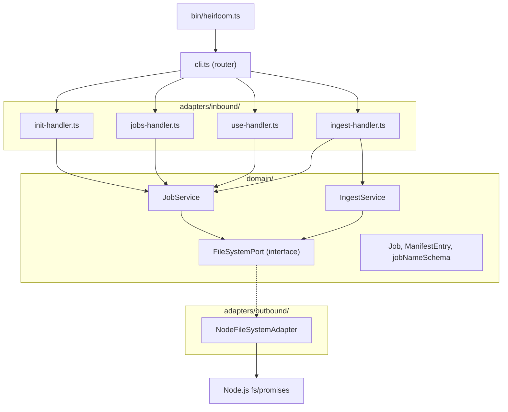

# Design Document: CLI Commands Implementation

## Overview

This design covers the implementation of four local-filesystem CLI commands (`init`, `jobs`, `use`, `ingest`) for the Heirloom CLI tool. Each command replaces its current stub handler with working logic, following the project's hexagonal architecture.

The implementation introduces:
- **Domain models** (`Job`, `ManifestEntry`) validated with Zod v4 schemas
- **A domain port** (`FileSystemPort`) abstracting all filesystem operations
- **Two domain services** (`JobService`, `IngestService`) containing pure business logic
- **An outbound adapter** (`NodeFileSystemAdapter`) implementing the port with Node.js `fs/promises`
- **Four inbound handler rewrites** wiring CLI args → domain services → filesystem adapter

All operations are purely local — no AWS services are involved.

## Architecture



**Data flow for each command:**

1. **`init <name>`** → `init-handler` → `JobService.createJob(name)` → `FileSystemPort.createDirectory()`
2. **`jobs`** → `jobs-handler` → `JobService.listJobs()` → `FileSystemPort.listDirectory()` / `exists()` / `readFile()`
3. **`use <name>`** → `use-handler` → `JobService.setActiveJob(name)` → `FileSystemPort.writeFile()` / `exists()`
4. **`ingest`** → `ingest-handler` → `JobService.getActiveJob()` → `IngestService.ingest(jobName)` → `FileSystemPort.listDirectory()` / `readFile()` / `writeFile()`

## Components and Interfaces

### Domain Port: `FileSystemPort`

**File:** `src/domain/ports/file-system-port.ts`

```typescript
export interface FileSystemPort {
  createDirectory(path: string): Promise<void>;
  exists(path: string): Promise<boolean>;
  listDirectory(path: string): Promise<string[]>;
  readFile(path: string): Promise<string>;
  writeFile(path: string, content: string): Promise<void>;
}
```

Design decision: The port is intentionally minimal — only the five operations needed by the two domain services. `createDirectory` creates recursively (the adapter handles `{ recursive: true }`). `listDirectory` returns entry names only (not full paths), matching `fs.readdir` semantics.

### Domain Service: `JobService`

**File:** `src/domain/services/job-service.ts`

```typescript
export class JobService {
  constructor(private readonly fs: FileSystemPort, private readonly jobsRoot: string) {}

  async createJob(name: string): Promise<void>;
  async listJobs(): Promise<Job[]>;
  async getActiveJob(): Promise<string | undefined>;
  async setActiveJob(name: string): Promise<void>;
  validateJobName(name: string): void; // throws HeirloomError on invalid
}
```

- `jobsRoot` defaults to `"jobs"` — the relative path to the jobs directory.
- `validateJobName` uses the Zod `jobNameSchema` and throws `HeirloomError` with a descriptive message on failure.
- `createJob` validates the name, checks for existing directory, creates `jobs/<name>/images/`.
- `listJobs` reads `jobs/` entries, derives status for each, reads `.active-job` to mark the active one.
- `setActiveJob` validates the name, checks the job directory exists, writes `jobs/.active-job`.
- `getActiveJob` reads `jobs/.active-job` if it exists, returns `undefined` otherwise.

### Domain Service: `IngestService`

**File:** `src/domain/services/ingest-service.ts`

```typescript
export class IngestService {
  constructor(private readonly fs: FileSystemPort) {}

  async ingest(jobDir: string): Promise<{ discovered: number; total: number }>;
}
```

- `ingest` scans `<jobDir>/images/` for supported extensions, reads existing `manifest.csv` if present, merges new entries preserving existing annotations, writes the result sorted alphabetically by filename.
- Returns counts for CLI output: `discovered` (new images added) and `total` (all manifest rows).

**Supported image extensions:** `.jpg`, `.jpeg`, `.png`, `.tiff`, `.tif`, `.bmp`, `.webp`

### CSV Utilities

**File:** `src/domain/services/csv-utils.ts`

```typescript
export const MANIFEST_COLUMNS = ['filename', 'recipe_name', 'source_collection', 'image_type', 'notes'] as const;

export function serializeManifest(entries: ManifestEntry[]): string;
export function parseManifest(csv: string): ManifestEntry[];
```

- `serializeManifest` produces RFC 4180-compliant CSV with LF line endings.
- `parseManifest` parses CSV back into `ManifestEntry[]`, handling quoted fields.
- These are pure functions — no I/O, no side effects — making them ideal for property-based testing.

### Outbound Adapter: `NodeFileSystemAdapter`

**File:** `src/adapters/outbound/node-file-system-adapter.ts`

```typescript
import type { FileSystemPort } from '../../domain/ports/file-system-port.js';

export class NodeFileSystemAdapter implements FileSystemPort {
  async createDirectory(path: string): Promise<void>;   // fs.mkdir({ recursive: true })
  async exists(path: string): Promise<boolean>;          // fs.access, catch → false
  async listDirectory(path: string): Promise<string[]>;  // fs.readdir
  async readFile(path: string): Promise<string>;         // fs.readFile('utf-8')
  async writeFile(path: string, content: string): Promise<void>; // fs.writeFile
}
```

### Inbound Handlers

Each handler follows the same pattern:
1. Parse/validate CLI args
2. Construct `NodeFileSystemAdapter` and domain service(s)
3. Call the service method
4. Print output to stdout (success) or stderr (error) and set `process.exitCode`

**Handler → Service wiring** (constructed inside each handler, no DI container):

```typescript
// Example: init-handler.ts
const fs = new NodeFileSystemAdapter();
const jobService = new JobService(fs, 'jobs');
```

Design decision: Direct construction in handlers rather than a DI container. The project is small, and the hexagonal boundary is maintained by the port interface. Tests inject mock `FileSystemPort` implementations directly into services.


## Data Models

### `jobNameSchema`

```typescript
import { z } from 'zod/v4';

export const jobNameSchema = z
  .string()
  .min(1, 'Job name must not be empty')
  .max(128, 'Job name must not exceed 128 characters')
  .regex(/^[a-z0-9][a-z0-9_-]*$/, 'Job name must be lowercase alphanumeric, hyphens, underscores, and start with a letter or digit');

export type JobName = z.infer<typeof jobNameSchema>;
```

### `jobStatusSchema`

```typescript
export const jobStatusSchema = z.enum(['empty', 'initialized', 'ingested']);
export type JobStatus = z.infer<typeof jobStatusSchema>;
```

Status derivation logic (in `JobService.listJobs`):
- `ingested` — `manifest.csv` exists in the job directory
- `initialized` — `images/` directory exists but no `manifest.csv`
- `empty` — fallback (no `images/` directory, or `images/` is empty — shouldn't happen for well-formed jobs)

### `jobSchema`

```typescript
export const jobSchema = z.object({
  name: jobNameSchema,
  status: jobStatusSchema,
  isActive: z.boolean(),
});
export type Job = z.infer<typeof jobSchema>;
```

### `manifestEntrySchema`

```typescript
export const manifestEntrySchema = z.object({
  filename: z.string().min(1),
  recipeName: z.string().default(''),
  sourceCollection: z.string().default(''),
  imageType: z.string().default(''),
  notes: z.string().default(''),
});
export type ManifestEntry = z.infer<typeof manifestEntrySchema>;
```

### Supported Image Extensions

```typescript
export const SUPPORTED_IMAGE_EXTENSIONS = new Set([
  '.jpg', '.jpeg', '.png', '.tiff', '.tif', '.bmp', '.webp',
]);
```


## Correctness Properties

*A property is a characteristic or behavior that should hold true across all valid executions of a system — essentially, a formal statement about what the system should do. Properties serve as the bridge between human-readable specifications and machine-verifiable correctness guarantees.*

### Property 1: Job name validation is consistent with the pattern

*For any* string, `jobNameSchema` accepts it if and only if it matches `^[a-z0-9][a-z0-9_-]*$` and has length between 1 and 128 characters. Conversely, any string that violates the pattern, is empty, or exceeds 128 characters is rejected.

**Validates: Requirements 1.1, 1.2, 1.3, 1.4**

### Property 2: Init creates the correct directory structure

*For any* valid job name where the job does not already exist, calling `JobService.createJob(name)` results in `FileSystemPort.createDirectory` being called with the path `jobs/<name>/images/`.

**Validates: Requirements 2.1, 2.5**

### Property 3: Init rejects duplicate jobs

*For any* valid job name where the job directory already exists, calling `JobService.createJob(name)` throws a `HeirloomError` without calling `createDirectory`.

**Validates: Requirements 2.2**

### Property 4: Job status derivation from filesystem state

*For any* job directory, the derived `JobStatus` is `ingested` when `manifest.csv` exists, `initialized` when `images/` exists but `manifest.csv` does not, and `empty` otherwise. The derivation is deterministic given the filesystem state.

**Validates: Requirements 3.4**

### Property 5: Use command persists active job

*For any* valid job name where the job directory exists, calling `JobService.setActiveJob(name)` writes the job name to `jobs/.active-job`, and a subsequent `getActiveJob()` returns that same name.

**Validates: Requirements 4.1, 4.5**

### Property 6: Use command rejects non-existent jobs

*For any* valid job name where the job directory does not exist, calling `JobService.setActiveJob(name)` throws a `HeirloomError` without writing the `.active-job` file.

**Validates: Requirements 4.2**

### Property 7: Ingest produces a correct manifest from image files

*For any* set of filenames in an images directory, `IngestService.ingest` produces a manifest containing exactly the files with supported image extensions (`.jpg`, `.jpeg`, `.png`, `.tiff`, `.tif`, `.bmp`, `.webp`), one row per file, sorted alphabetically by filename, with `filename` populated and all annotation columns empty.

**Validates: Requirements 5.1, 5.2, 5.3, 5.8**

### Property 8: Manifest merge preserves annotations and avoids duplicates

*For any* existing manifest with user-annotated rows and any set of new image filenames, running ingest produces a manifest where: (a) all previously annotated rows retain their annotations, (b) no filename appears more than once, and (c) newly discovered images are added with empty annotation columns.

**Validates: Requirements 5.7**

### Property 9: CSV serialization round-trip

*For any* array of valid `ManifestEntry` objects, serializing to CSV with `serializeManifest` and parsing back with `parseManifest` yields an array deeply equal to the original input.

**Validates: Requirements 6.1, 6.2, 6.3, 6.4**

## Error Handling

All errors follow the existing `HeirloomError` pattern from `src/shared/errors.ts`.

### Error Categories

| Error Scenario | Source | Message Pattern | Exit Code |
|---|---|---|---|
| Invalid job name | `JobService.validateJobName` | `"Invalid job name: <reason>"` | 1 |
| Missing job name arg | Handler | `"Job name is required. Usage: heirloom <cmd> <job-name>"` | 1 |
| Job already exists | `JobService.createJob` | `"Job '<name>' already exists"` | 1 |
| Job not found | `JobService.setActiveJob` | `"Job '<name>' not found"` | 1 |
| No active job | Handler | `"No active job selected. Run 'heirloom use <job-name>' first"` | 1 |
| No images found | `IngestService.ingest` | `"No image files found in <path>"` | 1 |
| Filesystem error | Adapter (wrapped) | `"Failed to <operation>: <original message>"` | 1 |

### Error Flow

1. Domain services throw `HeirloomError` with descriptive messages
2. Handlers catch `HeirloomError` and print `error.message` to stderr
3. The CLI router's existing catch block in `cli.ts` handles any uncaught errors, printing the message and setting `process.exitCode = 1`
4. Stack traces are never exposed to the user (the router only prints `error.message`)

## Testing Strategy

### Unit Tests (`.unit.ts`, colocated)

| File | Tests |
|---|---|
| `src/domain/models/job.unit.ts` | Zod schema validation for `jobNameSchema`, `jobSchema`, `manifestEntrySchema` |
| `src/domain/services/job-service.unit.ts` | `createJob`, `listJobs`, `getActiveJob`, `setActiveJob` with mock `FileSystemPort` |
| `src/domain/services/ingest-service.unit.ts` | `ingest` with mock `FileSystemPort` — fresh ingest, merge, no images, filtering |
| `src/domain/services/csv-utils.unit.ts` | `serializeManifest`, `parseManifest` — header, quoting, edge cases |
| `src/adapters/inbound/init-handler.unit.ts` | Arg parsing, success output, error output |
| `src/adapters/inbound/jobs-handler.unit.ts` | Listing output, empty state, active job marking |
| `src/adapters/inbound/use-handler.unit.ts` | Arg parsing, success output, error output |
| `src/adapters/inbound/ingest-handler.unit.ts` | No active job, success output, error output |

### Property-Based Tests (`.pbt.ts`, colocated)

Using `fast-check` with minimum 100 iterations per property.

| File | Properties Tested |
|---|---|
| `src/domain/models/job.pbt.ts` | Property 1: Job name validation consistency |
| `src/domain/services/job-service.pbt.ts` | Properties 2, 3, 4, 5, 6: Job creation, status derivation, active job |
| `src/domain/services/ingest-service.pbt.ts` | Properties 7, 8: Manifest generation and merge |
| `src/domain/services/csv-utils.pbt.ts` | Property 9: CSV round-trip |

Each property test is tagged with a comment:
```typescript
// Feature: cli-commands-implementation, Property 9: CSV serialization round-trip
```

### Test Configuration

- `fast-check` configured with `{ numRuns: 100 }` minimum per property
- Custom arbitraries for `JobName` (valid pattern strings), `ManifestEntry` (random field values including special characters), and filename sets (mix of image and non-image extensions)
- Mock `FileSystemPort` implementation for all domain service tests — records calls and returns configurable responses
