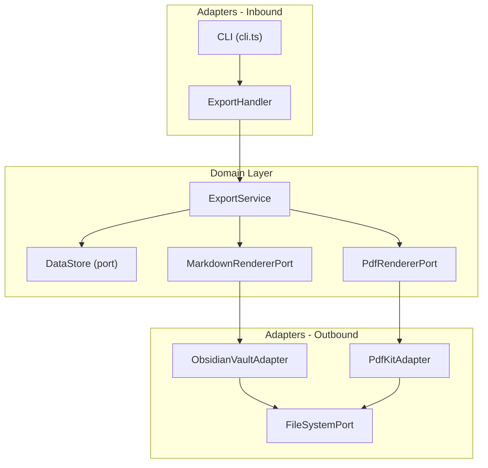
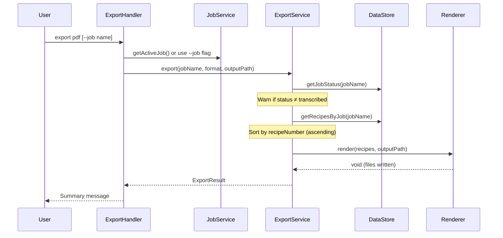

# Design Document: Export Commands

## Overview

The export-commands feature replaces the current stub `export` handler with two concrete output formats: a print-ready PDF cookbook and an interlinked Obsidian vault. The design follows the existing hexagonal architecture — a domain-level `ExportService` orchestrates recipe retrieval and delegates rendering to outbound port implementations (`PdfRenderer` and `VaultWriter`).

Key design decisions:

1. **Two new ports** — `PdfRendererPort` and `MarkdownRendererPort` — keep the domain layer free of PDF library and file format concerns.
2. **Pure rendering functions** for Markdown — `renderRecipeMarkdown` and `renderIndexMarkdown` — are standalone pure functions that accept domain models and return strings. This makes them trivially testable without file system access.
3. **Slugification as a pure utility** — `slugify` lives in the domain services layer as a pure function, testable via property-based testing.
4. **PDFKit** is the chosen PDF library — mature, zero-native-dependency, streams-based, well-suited for programmatic document generation in Node.js.
5. **No new YAML dependency** — YAML frontmatter is simple enough to generate via string concatenation. For round-trip verification in tests, the `yaml` npm package is used as a dev dependency only.

## Architecture

The feature integrates into the existing hexagonal architecture at three layers:



### Data Flow



## Components and Interfaces

### 1. ExportService (Domain Service)

Location: `src/domain/services/export-service.ts`

Orchestrates the export workflow. Depends only on ports and domain models.

```typescript
interface ExportResult {
  recipeCount: number;
  outputPath: string;
  warnings: string[];
}

type ExportFormat = 'pdf' | 'obsidian';

class ExportService {
  constructor(
    private readonly dataStore: DataStore,
    private readonly pdfRenderer: PdfRendererPort,
    private readonly markdownRenderer: MarkdownRendererPort,
  ) {}

  async export(jobName: string, format: ExportFormat, outputPath: string): Promise<ExportResult>;
}
```

Responsibilities:
- Retrieve job status from DataStore; error if job not found, warn if not `transcribed`
- Retrieve recipes from DataStore; error if zero recipes
- Sort recipes by `recipeNumber` ascending (lexicographic)
- Delegate to the appropriate renderer port based on format
- Return an `ExportResult` with count, path, and any warnings

### 2. PdfRendererPort (Domain Port)

Location: `src/domain/ports/pdf-renderer-port.ts`

```typescript
interface PdfRendererPort {
  render(recipes: Recipe[], outputPath: string): Promise<void>;
}
```

Contract:
- Produces a single PDF file at `outputPath`
- Each recipe rendered as a section with title, recipeNumber, source, ingredients, instructions, notes
- Table of contents at the beginning
- Review markers on fields with confidence < 0.7
- Image key references included per recipe

### 3. MarkdownRendererPort (Domain Port)

Location: `src/domain/ports/markdown-renderer-port.ts`

```typescript
interface MarkdownRendererPort {
  renderVault(recipes: Recipe[], outputDir: string): Promise<void>;
}
```

Contract:
- Creates one `.md` file per recipe plus an `_index.md`
- Filenames: `<recipeNumber>-<slugified-title>.md`
- YAML frontmatter with recipeNumber, jobName, imageKeys, tags
- Wikilinks for source cross-referencing
- `needs-review` tag and inline comments for low-confidence fields

### 4. Pure Markdown Functions (Domain Services)

Location: `src/domain/services/markdown-utils.ts`

```typescript
function renderRecipeMarkdown(recipe: Recipe): string;
function renderIndexMarkdown(recipes: Recipe[]): string;
function slugify(title: string): string;
function buildVaultFilename(recipeNumber: string, title: string): string;
```

These are pure functions with no side effects. The `ObsidianVaultAdapter` calls them and writes the results to disk via `FileSystemPort`.

### 5. PdfKitAdapter (Outbound Adapter)

Location: `src/adapters/outbound/pdfkit-adapter.ts`

Implements `PdfRendererPort` using the `pdfkit` library. Handles:
- Document creation with page layout
- Table of contents generation
- Per-recipe section rendering
- Confidence review markers
- Writing the PDF stream to disk via `FileSystemPort`

### 6. ObsidianVaultAdapter (Outbound Adapter)

Location: `src/adapters/outbound/obsidian-vault-adapter.ts`

Implements `MarkdownRendererPort`. Uses the pure functions from `markdown-utils.ts` and writes files via `FileSystemPort`.

### 7. ExportHandler (Inbound Adapter)

Location: `src/adapters/inbound/export-handler.ts`

Replaces the current stub. Parses CLI arguments, resolves the job name (active job or `--job` flag), constructs the output path, wires up adapters, and invokes `ExportService`.

## Data Models

### ExportFormat

```typescript
// In export-service.ts
type ExportFormat = 'pdf' | 'obsidian';
```

### ExportResult

```typescript
interface ExportResult {
  recipeCount: number;
  outputPath: string;
  warnings: string[];
}
```

### Recipe (existing — no changes)

The existing `Recipe` type from `src/domain/models/recipe.ts` is used as-is. All fields are already available for both PDF and Markdown rendering:

```typescript
type Recipe = {
  jobName: string;
  recipeNumber: string;
  source: string;
  title: string;
  ingredients: string[];
  instructions: string[];
  notes: string;
  imageKeys: string[];
  confidence: {
    title: number;
    ingredients: number;
    instructions: number;
    notes: number;
  };
};
```

### Markdown Frontmatter Shape

The YAML frontmatter produced by `renderRecipeMarkdown` follows this structure:

```yaml
---
recipeNumber: "001"
jobName: "grandma-cards"
imageKeys:
  - "grandma-cards/img001.jpg"
tags:
  - needs-review  # only if any confidence < 0.7
---
```

### Output Directory Structure

```
./exports/<jobName>/
├── <jobName>.pdf          # PDF export
└── vault/                 # Obsidian export
    ├── _index.md
    ├── 001-chocolate-cake.md
    ├── 002-apple-pie.md
    └── ...
```


## Correctness Properties

*A property is a characteristic or behavior that should hold true across all valid executions of a system — essentially, a formal statement about what the system should do. Properties serve as the bridge between human-readable specifications and machine-verifiable correctness guarantees.*

### Property 1: Recipe sorting invariant

*For any* list of Recipe objects returned by the DataStore, after the ExportService sorts them, the resulting list SHALL have recipeNumbers in ascending lexicographic order — that is, for every adjacent pair `recipes[i]` and `recipes[i+1]`, `recipes[i].recipeNumber <= recipes[i+1].recipeNumber`.

**Validates: Requirements 2.3**

### Property 2: Markdown frontmatter round-trip

*For any* valid Recipe object, rendering it to Markdown via `renderRecipeMarkdown` and then parsing the YAML frontmatter SHALL produce an object containing the original `recipeNumber`, `jobName`, and `imageKeys` values unchanged.

**Validates: Requirements 8.3, 4.4, 4.7**

### Property 3: Markdown body content preservation and structure

*For any* valid Recipe object, the Markdown string produced by `renderRecipeMarkdown` SHALL contain the recipe title as a level-1 heading, and SHALL contain every ingredient string, every instruction string, and the notes string verbatim (without normalization or reformatting).

**Validates: Requirements 4.3, 8.4**

### Property 4: Source wikilink conditional presence

*For any* valid Recipe object, if the `source` field is non-empty, the Markdown output of `renderRecipeMarkdown` SHALL contain a `[[source:<source>]]` wikilink. If the `source` field is empty, no such wikilink SHALL appear.

**Validates: Requirements 4.5**

### Property 5: Low-confidence review annotations

*For any* valid Recipe object, if any confidence score (title, ingredients, instructions, notes) is below 0.7, the Markdown output of `renderRecipeMarkdown` SHALL include `needs-review` in the YAML frontmatter tags, and each field whose confidence is below 0.7 SHALL have an inline comment annotation. If all confidence scores are ≥ 0.7, `needs-review` SHALL NOT appear in the tags.

**Validates: Requirements 4.6**

### Property 6: Index completeness

*For any* non-empty list of Recipe objects, the Markdown string produced by `renderIndexMarkdown` SHALL contain a wikilink for every recipe in the list, and the number of wikilinks SHALL equal the number of recipes.

**Validates: Requirements 4.8**

### Property 7: Slugification validity

*For any* non-empty string, the `slugify` function SHALL produce a non-empty string that: (a) contains only lowercase alphanumeric characters and hyphens `[a-z0-9-]`, (b) contains no consecutive hyphens, and (c) has a length of at most 100 characters.

**Validates: Requirements 9.1, 9.2, 9.3**

## Error Handling

Errors follow the existing `HeirloomError` pattern from `src/shared/errors.ts`.

| Scenario | Error Type | Behavior |
|---|---|---|
| No format argument provided | N/A (not an error) | Print usage message, exit cleanly |
| Unrecognized format argument | Console error | Print error with valid options, set `process.exitCode = 1` |
| No active job and no `--job` flag | Console error | Print message directing user to `heirloom use`, set `process.exitCode = 1` |
| Job not found in DataStore | `HeirloomError` | "Job '<name>' not found", abort export |
| Job status ≠ `transcribed` | Warning (non-fatal) | Print warning, continue with available recipes |
| Zero recipes for job | `HeirloomError` | "No recipes found for job '<name>'", abort export |
| Renderer throws during rendering | `HeirloomError` (re-thrown) | Report error, leave partial output in place for debugging |
| File system write failure | `HeirloomError` (wrapped) | Report error with path context |

The ExportHandler catches `HeirloomError` instances and prints the message to stderr with a non-zero exit code, matching the pattern used by `transcribe-handler.ts`. Unexpected errors are re-thrown to surface stack traces.

## Testing Strategy

### Unit Tests

Unit tests cover the handler, service, and adapter layers with mocked dependencies:

**ExportHandler (`export-handler.unit.ts`)**:
- Parses `pdf` and `obsidian` format arguments correctly
- Prints usage when no format is given
- Prints error for unrecognized formats
- Resolves `--job` flag override vs active job
- Prints summary on success
- Handles errors gracefully

**ExportService (`export-service.unit.ts`)**:
- Calls DataStore.getJobStatus before getRecipesByJob
- Throws when job not found
- Warns when job status ≠ transcribed
- Throws when zero recipes returned
- Sorts recipes by recipeNumber before passing to renderer
- Delegates to correct renderer based on format
- Returns ExportResult with correct count and path
- Reports errors from renderer without cleanup

**PdfKitAdapter (`pdfkit-adapter.unit.ts`)**:
- Renders table of contents with all recipe titles
- Renders each recipe section with required fields
- Adds review markers for low-confidence fields
- Includes image key references

**ObsidianVaultAdapter (`obsidian-vault-adapter.unit.ts`)**:
- Creates correct directory structure
- Writes one file per recipe with correct filename
- Writes `_index.md`
- Overwrites existing files on re-export

### Property-Based Tests

Property-based tests use `fast-check` with a minimum of 100 iterations per property. Each test references its design document property.

**markdown-utils.pbt.ts**:
- **Feature: export-commands, Property 2**: Frontmatter round-trip — generate random Recipe objects, render to Markdown, parse YAML frontmatter, verify recipeNumber/jobName/imageKeys preserved
- **Feature: export-commands, Property 3**: Body content preservation — generate random Recipe objects, verify title heading and verbatim field content in output
- **Feature: export-commands, Property 4**: Source wikilink — generate recipes with/without source, verify wikilink presence/absence
- **Feature: export-commands, Property 5**: Low-confidence annotations — generate recipes with varying confidence scores, verify needs-review tag and inline comments
- **Feature: export-commands, Property 6**: Index completeness — generate random recipe lists, verify all wikilinks present
- **Feature: export-commands, Property 7**: Slugification — generate random non-empty strings, verify output format, no consecutive hyphens, length ≤ 100

**export-service.pbt.ts**:
- **Feature: export-commands, Property 1**: Sorting invariant — generate random recipe lists, verify ascending lexicographic order by recipeNumber after sort

### Test Dependencies

- `fast-check` (already installed) — property-based test generation
- `yaml` (dev dependency, to add) — YAML parsing for round-trip verification in tests only

### Integration Tests

Integration tests are deferred to manual verification since they involve PDF file generation and file system operations. The pure function layer (markdown-utils, slugify, sorting) carries the bulk of correctness guarantees via property-based tests.
