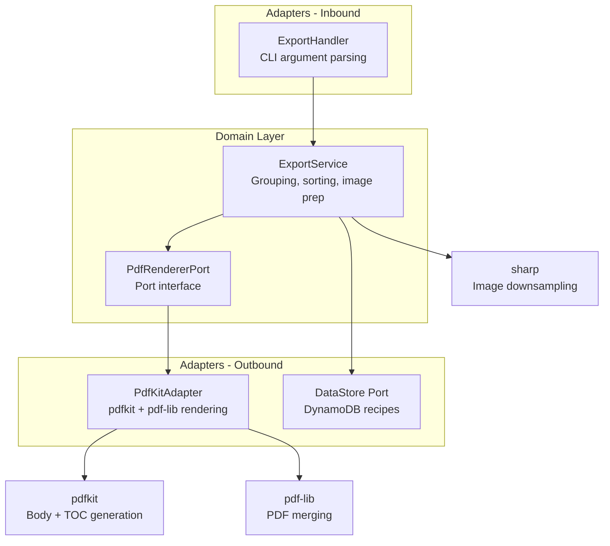
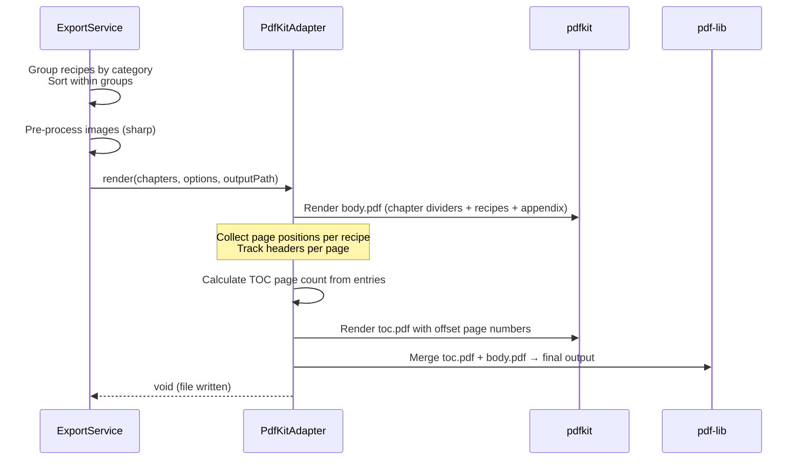
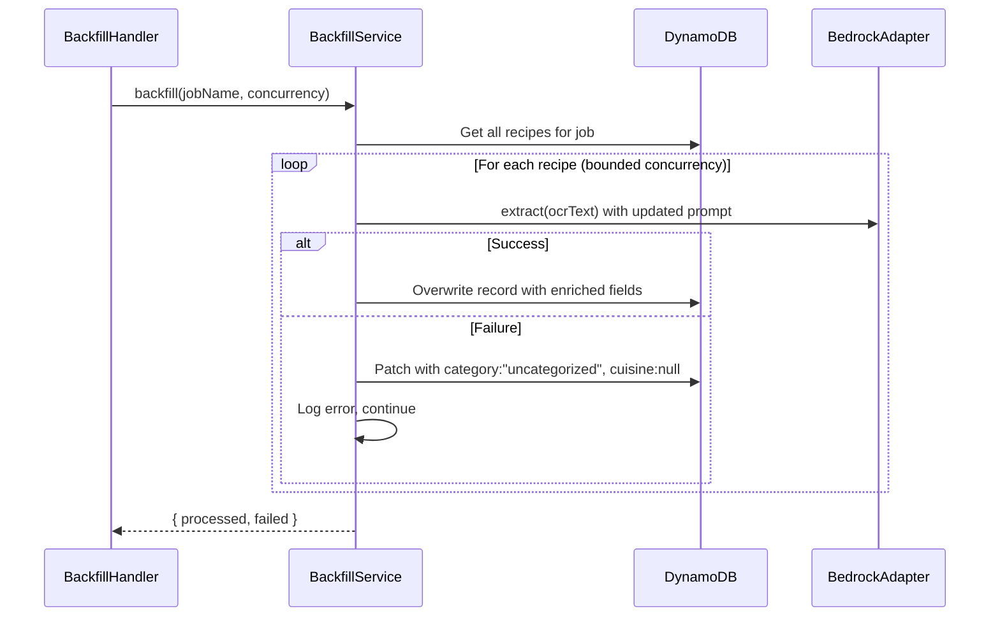

# Design Document: PDF Export Improvements

## Overview

This design overhauls the Heirloom PDF export pipeline from a flat, unstructured single-pass renderer into a professional-quality cookbook generator with chapter grouping, table of contents with page numbers, multi-recipe page layouts, image embedding, and full CLI control.

The implementation follows the existing hexagonal architecture: the domain layer owns grouping/sorting logic and the port interface contract (`PdfRendererPort`), while the `PdfKitAdapter` outbound adapter handles all rendering concerns. A new `PdfRenderOptions` typed options object threads CLI preferences through the port boundary without coupling domain logic to adapter internals.

Key architectural decisions:
- **Two-pass Body_TOC_Merge rendering**: Render body content first (collecting page positions), render TOC separately with offset page numbers, merge with `pdf-lib` into the final PDF
- **ExportService owns grouping**: Recipes are grouped by category, sorted within groups, and passed as structured chapter data to the renderer
- **Image pre-processing before render**: `sharp` downsamples images to target DPI before the synchronous pdfkit render pass, keeping the render method free of async I/O
- **pdfkit built-in fonts**: Helvetica for headings, Times-Roman for body — zero external font dependencies

## Architecture



### Rendering Pipeline (Body_TOC_Merge)



### Backfill Pipeline



## Components and Interfaces

### Domain Layer

#### `PdfRendererPort` (updated)

```typescript
// src/domain/ports/pdf-renderer-port.ts

import type { Recipe } from '../models/index.js';

export type ImageMode = 'none' | 'thumbnail' | 'full';
export type PageSize = 'letter' | 'a4';

export interface PdfRenderOptions {
  imageMode: ImageMode;
  pageSize: PageSize;
  multiPerPage: boolean;
  confidenceMarkers: boolean;
  chapterGrouping: boolean;
}

export interface ChapterGroup {
  chapter: string;
  recipes: Recipe[];
}

export interface PdfRendererPort {
  render(
    chapters: ChapterGroup[],
    options: PdfRenderOptions,
    outputPath: string,
  ): Promise<void>;
}
```

#### `Recipe` schema (extended)

```typescript
// src/domain/models/recipe.ts (additions)

export const categoryEnum = z.enum([
  'Appetizers & Snacks',
  'Soups & Stews',
  'Salads & Dressings',
  'Beef & Pork',
  'Poultry',
  'Seafood',
  'Pasta & Rice',
  'Sides & Vegetables',
  'Breads',
  'Cakes',
  'Pies & Pastries',
  'Cookies & Bars',
  'Beverages',
  'Sauces & Condiments',
  'uncategorized',
]);

export const cuisineEnum = z.enum([
  'American',
  'American Regional',
  'Mexican & Central American',
  'South American',
  'Caribbean',
  'Italian',
  'French',
  'European & Eastern European',
  'Mediterranean',
  'Middle Eastern',
  'African',
  'South Asian',
  'East Asian',
  'Southeast Asian',
  'Other',
]);

export const recipeSchema = z.object({
  jobName: z.string().min(1),
  recipeNumber: z.string().min(1),
  source: z.string(),
  title: z.string().min(1),
  author: z.string().nullable().default(null),
  year: z.number().int().nullable().default(null),
  category: categoryEnum,
  cuisine: cuisineEnum.nullable().default(null),
  tags: z.array(z.string().min(1)).default([]),
  ingredients: z.array(z.string().min(1)),
  instructions: z.array(z.string().min(1)),
  notes: z.array(z.string()).default([]),
  imageKeys: z.array(z.string().min(1)),
  confidence: z.object({
    title: confidenceScoreSchema,
    ingredients: confidenceScoreSchema,
    instructions: confidenceScoreSchema,
    notes: confidenceScoreSchema,
  }),
});
```

#### `ExportService` (updated)

The ExportService gains responsibility for:
1. Grouping recipes by `category` in canonical order
2. Sorting recipes alphabetically within each group
3. Pre-processing images (downsampling via sharp)
4. Constructing `ChapterGroup[]` data for the renderer

```typescript
// src/domain/services/export-service.ts (updated signature)

export class ExportService {
  async exportPdf(
    jobName: string,
    options: PdfRenderOptions,
    outputPath: string,
  ): Promise<ExportResult>;
}
```

The grouping logic maps `"uncategorized"` → display name `"Odds & Ends"`, omits empty chapters, and applies canonical order. When `options.chapterGrouping` is `false`, all recipes become a single flat group sorted alphabetically.

#### `BackfillService` (new)

```typescript
// src/domain/services/backfill-service.ts

export interface BackfillResult {
  totalProcessed: number;
  successCount: number;
  failedCount: number;
  failures: Array<{ recipeNumber: string; error: string }>;
}

export class BackfillService {
  constructor(
    private readonly dataStore: DataStore,
    private readonly extractor: StructureExtractor,
  ) {}

  async backfill(jobName: string, concurrency: number): Promise<BackfillResult>;
}
```

### Adapter Layer

#### `PdfKitAdapter` (rewritten)

The adapter is restructured into focused rendering methods:

| Method | Responsibility |
|--------|---------------|
| `render()` | Orchestrates Body_TOC_Merge pipeline |
| `renderBody()` | Renders chapter dividers, recipe pages, source appendix to temp file |
| `renderToc()` | Renders TOC pages with collected page numbers |
| `mergeDocuments()` | Merges toc.pdf + body.pdf using pdf-lib |
| `renderChapterDivider()` | Full-page centered category title |
| `renderRecipe()` | Single recipe with title, attribution, sections |
| `renderSourceAppendix()` | Compact source-grouped listing |
| `estimateRecipeHeight()` | Uses `doc.heightOfString()` for layout decisions |
| `stampHeaders()` | Retroactively writes page headers at fixed coordinates |

#### `BedrockAdapter` (augmented prompt)

The `buildPrompt()` method is updated to include:
- `category` field constrained to the 14-item canonical enum (excludes "uncategorized")
- `cuisine` field constrained to the 15-item cuisine enum (nullable)
- Classification heuristic with precedence chain (type exceptions → protein → structure → fallback)
- At least 3 few-shot disambiguation examples with rationale

#### Image Pre-Processing (new utility)

```typescript
// src/domain/services/image-processor.ts

export interface ProcessedImage {
  originalKey: string;
  localPath: string;       // resolved path to downsampled file
  widthPx: number;
  heightPx: number;
}

export async function preprocessImages(
  imageKeys: string[],
  jobName: string,
  targetWidthPx: number,
  targetDpi: number,
): Promise<ProcessedImage[]>;
```

Uses `sharp` to:
1. Resolve imageKey → local path (`jobs/<jobName>/images/<filename>`)
2. Resize to target width at 150 DPI
3. Write to a temp directory as JPEG (quality 75 for thumbnail, 85 for full)
4. Return metadata for the adapter to embed

### CLI Layer

#### `ExportHandler` (updated)

Parses new options via manual argument parsing (matching existing pattern):

| Flag | Type | Default | Mapping |
|------|------|---------|---------|
| `--images` | `none\|thumbnail\|full` | `thumbnail` | `options.imageMode` |
| `--page-size` | `letter\|a4` | `letter` | `options.pageSize` |
| `--multi-per-page` | boolean | `true` | `options.multiPerPage` |
| `--confidence` | boolean | `true` | `options.confidenceMarkers` |
| `--no-chapters` | boolean | `false` | `options.chapterGrouping = !flag` |

Invalid values produce an error message with valid options and exit code 1.

#### `BackfillHandler` (new)

```
heirloom backfill [--job <name>] [--concurrency <n>]
```

## Data Models

### Recipe (DynamoDB - updated)

| Attribute | Type | Notes |
|-----------|------|-------|
| `jobName` | `S` (PK) | Partition key |
| `recipeNumber` | `S` (SK) | Sort key |
| `source` | `S` | Source collection name |
| `title` | `S` | Recipe title |
| `author` | `S \| null` | Contributor name |
| `year` | `N \| null` | Year contributed |
| `category` | `S` | **New** — one of 15-item enum |
| `cuisine` | `S \| null` | **New** — one of 15-item cuisine enum or null |
| `tags` | `L<S>` | Freeform supplementary tags |
| `ingredients` | `L<S>` | Ingredients list |
| `instructions` | `L<S>` | Instructions list |
| `notes` | `L<S>` | Notes list |
| `imageKeys` | `L<S>` | S3 keys for source images |
| `confidence` | `M` | `{ title, ingredients, instructions, notes }` scores |

### PdfRenderOptions

```typescript
{
  imageMode: 'none' | 'thumbnail' | 'full';  // default: 'thumbnail'
  pageSize: 'letter' | 'a4';                  // default: 'letter'
  multiPerPage: boolean;                       // default: true
  confidenceMarkers: boolean;                  // default: true
  chapterGrouping: boolean;                    // default: true
}
```

### ChapterGroup (in-memory structure passed to renderer)

```typescript
{
  chapter: string;          // Display name (e.g., "Beef & Pork", "Odds & Ends")
  recipes: Recipe[];        // Sorted alphabetically by title
}
```

### Page Layout Constants

| Constant | Letter | A4 |
|----------|--------|----|
| Page width (pt) | 612 | 595.28 |
| Page height (pt) | 792 | 841.89 |
| Margins (all sides) | 72pt | 72pt |
| Content width | 468pt | 451.28pt |
| Content height | 648pt | 697.89pt |

### Typography Scale

| Element | Font | Size | Style |
|---------|------|------|-------|
| Chapter divider title | Helvetica-Bold | 28pt | — |
| Recipe title | Helvetica-Bold | 18pt | — |
| Section heading | Helvetica-Bold | 12pt | — |
| Body text | Times-Roman | 11pt | — |
| Attribution | Times-Italic | 10pt | — |
| Footer/image refs | Helvetica | 8pt | 0.4 grayscale |


## Correctness Properties

*A property is a characteristic or behavior that should hold true across all valid executions of a system — essentially, a formal statement about what the system should do. Properties serve as the bridge between human-readable specifications and machine-verifiable correctness guarantees.*

### Property 1: Schema enum validation (category and cuisine)

*For any* string value provided as `category`, the `recipeSchema` SHALL accept it if and only if it is one of the 15 canonical category enum values. *For any* string value provided as `cuisine`, the `recipeSchema` SHALL accept it if and only if it is one of the 15 cuisine enum values or `null`. All other values SHALL produce a validation error.

**Validates: Requirements 1.1, 1.2, 1.4, 1.5**

### Property 2: FM response category/cuisine validation

*For any* mock Bedrock response containing a `category` value not in the 14-item canonical enum (excluding "uncategorized") or a `cuisine` value not in the 15-item cuisine enum and not null, the BedrockAdapter SHALL reject the response with a schema validation error.

**Validates: Requirements 2.5, 2.6**

### Property 3: Attribution format correctness

*For any* recipe with arbitrary `author` (string | null) and `year` (number | null) values, the rendered attribution line SHALL follow exactly one of: "By [author], [year]" when both non-null, "By [author]" when only author is non-null, "[year]" when only year is non-null, or no attribution line when both are null.

**Validates: Requirements 4.1, 4.2, 4.3, 4.4**

### Property 4: Chapter grouping preserves canonical order and completeness

*For any* non-empty set of recipes with valid category values, the ExportService grouping function SHALL produce an ordered array of ChapterGroup objects where: (a) groups appear in canonical category order with "Odds & Ends" last, (b) only categories containing at least one recipe appear, (c) every input recipe appears in exactly one group matching its category, and (d) recipes within each group are sorted alphabetically by title (case-insensitive).

**Validates: Requirements 5.5, 5.7, 6.3, 6.4, 6.5**

### Property 5: Flat mode produces single alphabetically-sorted group

*For any* non-empty set of recipes, when `chapterGrouping` is `false`, the ExportService SHALL produce a single ChapterGroup containing all recipes sorted alphabetically by title (case-insensitive), with no chapter dividers.

**Validates: Requirements 6.6, 14.3**

### Property 6: Source appendix grouping and ordering

*For any* set of recipes, the source appendix grouping function SHALL produce groups keyed by distinct source values (with empty/blank sources mapped to "Unknown Source"), ordered alphabetically by source name, with recipes within each source group sorted alphabetically by title.

**Validates: Requirements 7.2, 7.4, 7.5**

### Property 7: Multi-per-page fit decision

*For any* remaining page space value `R` and estimated next-recipe height `H`, the layout decision SHALL render the next recipe on the same page if and only if `R >= H + 24.5` (separator overhead: 12pt above + 0.5pt rule + 12pt below). Otherwise, it SHALL start a new page.

**Validates: Requirements 8.1, 8.2**

### Property 8: Cross-chapter page isolation

*For any* rendered PDF with chapter grouping enabled, no single page SHALL contain recipes belonging to different chapters. Every recipe on a shared page must have the same `category` value.

**Validates: Requirements 8.4**

### Property 9: Continuation header format

*For any* recipe title string, when a recipe overflows to an additional page, the continuation header SHALL be exactly `"[title], continued"` where `[title]` is the full recipe title.

**Validates: Requirements 9.2**

### Property 10: TOC page number offset

*For any* rendered PDF where the TOC occupies `N` pages, every page number displayed in the TOC for a recipe SHALL equal that recipe's position in the body document plus `N` (the TOC page count offset).

**Validates: Requirements 5.3, 5.4**

### Property 11: ImageKey path resolution

*For any* imageKey string in the format `"<jobName>/<filename>"`, the path resolution function SHALL produce the local path `"jobs/<jobName>/images/<filename>"` by extracting the filename portion after the first `/` separator and resolving against the job's images directory.

**Validates: Requirements 11.5**

### Property 12: Header and footer page-type invariant

*For any* page in the rendered PDF, page headers (chapter name + recipe title) and page number footers SHALL appear if and only if the page is a recipe content page. TOC pages and Chapter_Divider pages SHALL have no headers or footers.

**Validates: Requirements 10.4, 12.1, 12.2**

### Property 13: CLI option parsing with defaults and rejection

*For any* combination of valid CLI flag values for `--images`, `--page-size`, `--multi-per-page`, `--confidence`, and `--no-chapters`, the ExportHandler SHALL produce a PdfRenderOptions object with correct mappings and defaults for omitted flags (imageMode: "thumbnail", pageSize: "letter", multiPerPage: true, confidenceMarkers: true, chapterGrouping: true). *For any* unrecognized option value for `--images` or `--page-size`, the handler SHALL reject with an error message and exit code 1 without producing a PDF.

**Validates: Requirements 14.1, 14.2, 15.3, 15.5**

## Error Handling

### Schema Validation Errors

| Scenario | Behavior |
|----------|----------|
| Invalid `category` value in recipe data | `recipeSchema.safeParse` returns failure with field path and invalid value |
| Invalid `cuisine` value in recipe data | `recipeSchema.safeParse` returns failure with field path and invalid value |
| FM response fails schema validation | `BedrockAdapter.extract()` throws `HeirloomError` with validation details |

### Backfill Errors

| Scenario | Behavior |
|----------|----------|
| Single recipe extraction failure | Log error, patch record with `category: "uncategorized"`, `cuisine: null`, continue |
| ThrottlingException from Bedrock | Retry with exponential backoff + jitter (max 3 attempts), then mark as failed |
| Job not found | Throw `HeirloomError` — abort backfill |
| Zero recipes in job | Throw `HeirloomError` — nothing to backfill |

### PDF Rendering Errors

| Scenario | Behavior |
|----------|----------|
| Missing local image file (thumbnail/full mode) | Render placeholder text "Source image not available" in 8pt gray italic |
| Missing local image file (none mode) | No-op, no warning |
| Image pre-processing failure (sharp) | Log warning, skip that image, render placeholder |
| Empty recipe collection | Omit TOC, render empty PDF (or skip entirely based on ExportService validation) |
| Output directory doesn't exist | Create recursively via `mkdir -p` pattern (existing behavior) |

### CLI Errors

| Scenario | Behavior |
|----------|----------|
| Unrecognized `--images` value | Print error with valid values, set exit code 1, no PDF produced |
| Unrecognized `--page-size` value | Print error with valid values, set exit code 1, no PDF produced |
| Invalid `--concurrency` value (non-positive) | Print error, set exit code 1 |
| No active job and no `--job` flag | Print error directing user to `heirloom use`, exit code 1 |

## Testing Strategy

### Property-Based Tests (fast-check)

Property-based testing is applicable to this feature because the core logic involves pure functions with clear input/output behavior: schema validation, grouping/sorting algorithms, string formatting, path resolution, and CLI parsing. These all have universal properties that should hold across large input spaces.

**Configuration**: Each property test runs a minimum of 100 iterations. Tests are tagged with the design property they validate.

| Property | Test File | What It Tests |
|----------|-----------|---------------|
| Property 1 | `src/domain/models/recipe.pbt.ts` | Schema accepts/rejects category and cuisine values |
| Property 2 | `src/adapters/outbound/bedrock-adapter.pbt.ts` | Adapter rejects invalid FM responses |
| Property 3 | `src/adapters/outbound/pdfkit-adapter.pbt.ts` | Attribution format correctness |
| Property 4 | `src/domain/services/export-service.pbt.ts` | Chapter grouping canonical order + completeness |
| Property 5 | `src/domain/services/export-service.pbt.ts` | Flat mode alphabetical sort |
| Property 6 | `src/domain/services/export-service.pbt.ts` | Source appendix grouping |
| Property 7 | `src/adapters/outbound/pdfkit-adapter.pbt.ts` | Multi-per-page fit decision |
| Property 8 | `src/adapters/outbound/pdfkit-adapter.pbt.ts` | Cross-chapter page isolation |
| Property 9 | `src/adapters/outbound/pdfkit-adapter.pbt.ts` | Continuation header format |
| Property 10 | `src/adapters/outbound/pdfkit-adapter.pbt.ts` | TOC page number offset |
| Property 11 | `src/domain/services/export-service.pbt.ts` | ImageKey path resolution |
| Property 12 | `src/adapters/outbound/pdfkit-adapter.pbt.ts` | Header/footer page-type invariant |
| Property 13 | `src/adapters/inbound/export-handler.pbt.ts` | CLI option parsing + defaults + rejection |

**Tag format**: `Feature: pdf-export-improvements, Property {N}: {title}`

### Unit Tests (Jest)

Unit tests cover specific examples, edge cases, and integration points not suitable for PBT:

| Area | Test File | Coverage |
|------|-----------|----------|
| BedrockAdapter prompt construction | `bedrock-adapter.unit.ts` | Verifies category/cuisine enums, heuristics, few-shot examples in prompt |
| BackfillService orchestration | `backfill-service.unit.ts` | Error handling, retry logic, partial failure continuation |
| PdfKitAdapter visual output | `pdfkit-adapter.unit.ts` | Font sizes, margins, divider pages, TOC structure |
| ExportHandler CLI parsing | `export-handler.unit.ts` | Specific flag combinations, error messages |
| Image pre-processing | `image-processor.unit.ts` | Sharp integration, graceful degradation on missing files |

### Integration Tests

| Test | Location | What It Verifies |
|------|----------|------------------|
| Full PDF render pipeline | `test/pdf-export.test.ts` | End-to-end Body_TOC_Merge produces valid PDF with correct page count |
| Backfill with mock Bedrock | `test/backfill.test.ts` | All recipes processed, DynamoDB records updated |
| Image embedding | `test/image-embed.test.ts` | Sharp produces correct dimensions, pdfkit embeds without error |

### Test Library Selection

- **Property-based testing**: `fast-check` (already in devDependencies)
- **Unit/integration framework**: Jest 30 with `ts-jest` (existing setup)
- **PDF validation**: Parse output PDFs with `pdf-lib` in tests to verify page count, text content, and structure without visual inspection
