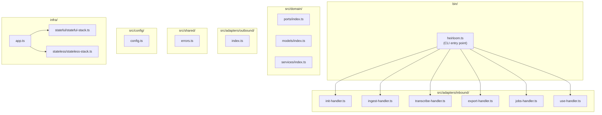
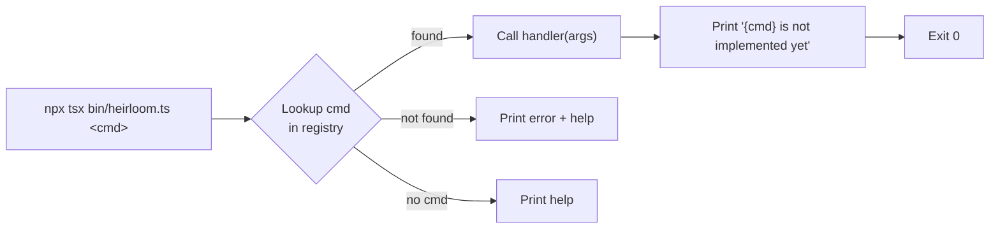

# Design Document

## Overview

This design covers the initial scaffolding of the Heirloom project: configuration files, directory structure, CLI entry point with command routing, stub handlers for all six commands, shared error infrastructure, a placeholder Convict configuration module, and minimal CDK stacks. The goal is a project that compiles, tests pass, and every CLI command can be invoked — all returning a consistent "not implemented yet" message.

The scope is deliberately narrow: no business logic, no AWS calls, no domain models beyond placeholders. This is the foundation that all subsequent feature specs build on.

### Key Design Decisions

1. **No CLI framework** — Command routing uses a simple `Map<string, CommandHandler>` lookup rather than a library like `commander` or `yargs`. The command set is small and fixed; a lightweight approach avoids an extra dependency and keeps the routing logic transparent and testable.

2. **Stub pattern** — Each command handler is a standalone async function conforming to a `CommandHandler` type alias. Stubs print `{command} is not implemented yet` and return. This makes each handler independently replaceable without touching the router.

3. **Barrel files for empty directories** — Directories like `src/domain/ports/`, `src/domain/models/`, and `src/domain/services/` get an `index.ts` that re-exports nothing initially. This establishes the import paths that future specs will populate.

4. **CDK app as a separate entry point** — The CDK app lives at `infra/app.ts` and is referenced by `cdk.json`. It instantiates empty `StatefulStack` and `StatelessStack` classes. This keeps infrastructure code isolated from application code per hexagonal architecture rules.

## Architecture

The project follows hexagonal (ports & adapters) architecture. At this scaffolding stage, only the skeleton is created — no ports are defined, no adapters connect to external services.



### CLI Command Flow



## Components and Interfaces

### 1. CLI Entry Point — `bin/heirloom.ts`

The entry point parses `process.argv`, extracts the command name and remaining arguments, then delegates to the command registry.

```typescript
// bin/heirloom.ts
import { runCli } from '../src/adapters/inbound/cli.js';

runCli(process.argv.slice(2));
```

### 2. Command Registry & Router — `src/adapters/inbound/cli.ts`

Central routing module. Defines the `CommandHandler` type and maintains a registry mapping command names to handlers.

```typescript
// src/adapters/inbound/cli.ts

export type CommandHandler = (args: string[]) => Promise<void>;

const commands: Map<string, CommandHandler> = new Map();

// Register all command handlers
commands.set('init', initHandler);
commands.set('ingest', ingestHandler);
commands.set('transcribe', transcribeHandler);
commands.set('export', exportHandler);
commands.set('jobs', jobsHandler);
commands.set('use', useHandler);

export function printHelp(): void {
  // Prints usage and lists available commands to stdout
}

export async function runCli(argv: string[]): Promise<void> {
  const [command, ...args] = argv;

  if (!command) {
    printHelp();
    return;
  }

  const handler = commands.get(command);
  if (!handler) {
    console.error(`Unknown command: ${command}`);
    printHelp();
    process.exitCode = 1;
    return;
  }

  await handler(args);
}
```

### 3. Command Handler Stubs — `src/adapters/inbound/{command}-handler.ts`

Each command gets its own file exporting a single `CommandHandler` function. All stubs share the same pattern:

```typescript
// src/adapters/inbound/init-handler.ts
import type { CommandHandler } from './cli.js';

export const initHandler: CommandHandler = async (_args) => {
  console.log('init is not implemented yet');
};
```

The six handler files follow identical structure:
- `init-handler.ts` → `"init is not implemented yet"`
- `ingest-handler.ts` → `"ingest is not implemented yet"`
- `transcribe-handler.ts` → `"transcribe is not implemented yet"`
- `export-handler.ts` → `"export is not implemented yet"`
- `jobs-handler.ts` → `"jobs is not implemented yet"`
- `use-handler.ts` → `"use is not implemented yet"`

A shared helper function `createStubHandler` can reduce duplication:

```typescript
// src/adapters/inbound/stub-handler.ts
import type { CommandHandler } from './cli.js';

export function createStubHandler(commandName: string): CommandHandler {
  return async (_args: string[]) => {
    console.log(`${commandName} is not implemented yet`);
  };
}
```

Each handler file then becomes:

```typescript
import { createStubHandler } from './stub-handler.js';
export const initHandler = createStubHandler('init');
```

**Rationale:** Using `createStubHandler` ensures the message format `{command} is not implemented yet` is defined in exactly one place. When a real implementation replaces a stub, the handler file is rewritten entirely — the stub factory is only used during scaffolding.

### 4. Shared Error Class — `src/shared/errors.ts`

```typescript
// src/shared/errors.ts
export class HeirloomError extends Error {
  constructor(message: string, cause?: unknown) {
    super(message, { cause });
    this.name = this.constructor.name;
  }
}
```

### 5. Configuration Module — `src/config/config.ts`

Uses Convict to define a typed configuration schema with environment variable overrides.

```typescript
// src/config/config.ts
import convict from 'convict';

const config = convict({
  aws: {
    region: {
      doc: 'AWS region for all services',
      format: String,
      default: 'us-east-1',
      env: 'HEIRLOOM_AWS_REGION',
    },
  },
  s3: {
    bucketName: {
      doc: 'S3 bucket for image storage',
      format: String,
      default: 'heirloom-images',
      env: 'HEIRLOOM_BUCKET_NAME',
    },
  },
  dynamodb: {
    recipesTableName: {
      doc: 'DynamoDB table for recipe records',
      format: String,
      default: 'heirloom-recipes',
      env: 'HEIRLOOM_RECIPES_TABLE',
    },
    jobsTableName: {
      doc: 'DynamoDB table for job tracking',
      format: String,
      default: 'heirloom-jobs',
      env: 'HEIRLOOM_JOBS_TABLE',
    },
  },
});

config.validate({ allowed: 'strict' });

export default config;
```

### 6. CDK Stacks — `infra/`

#### `infra/app.ts` — CDK App Entry Point

```typescript
import * as cdk from 'aws-cdk-lib';
import { StatefulStack } from './stateful/stateful-stack.js';
import { StatelessStack } from './stateless/stateless-stack.js';

const app = new cdk.App();
new StatefulStack(app, 'HeirloomStatefulStack');
new StatelessStack(app, 'HeirloomStatelessStack');
```

#### `infra/stateful/stateful-stack.ts`

```typescript
import * as cdk from 'aws-cdk-lib';
import type { Construct } from 'constructs';

export class StatefulStack extends cdk.Stack {
  constructor(scope: Construct, id: string, props?: cdk.StackProps) {
    super(scope, id, props);
    // Resources will be added by future specs
  }
}
```

#### `infra/stateless/stateless-stack.ts`

Same pattern as `StatefulStack`.

### 7. Barrel Files

Empty re-export files that establish import paths:
- `src/domain/ports/index.ts`
- `src/domain/models/index.ts`
- `src/domain/services/index.ts`
- `src/adapters/outbound/index.ts`

Each contains a single comment: `// Barrel file — exports will be added by feature specs`

## Data Models

This scaffolding spec defines no domain data models. The only "data" structures are:

### CommandHandler Type

```typescript
type CommandHandler = (args: string[]) => Promise<void>;
```

A function that receives the remaining CLI arguments after the command name and returns a promise. Stubs ignore the args parameter.

### Command Registry

```typescript
Map<string, CommandHandler>
```

Maps command name strings (`"init"`, `"ingest"`, etc.) to their handler functions. This is an in-memory data structure, not persisted.

### Convict Config Schema

The configuration object has this shape:

```typescript
{
  aws: { region: string },
  s3: { bucketName: string },
  dynamodb: {
    recipesTableName: string,
    jobsTableName: string,
  }
}
```

All values are strings with sensible defaults for local development. No validation beyond Convict's built-in `String` format.


## Correctness Properties

*A property is a characteristic or behavior that should hold true across all valid executions of a system — essentially, a formal statement about what the system should do. Properties serve as the bridge between human-readable specifications and machine-verifiable correctness guarantees.*

### Property 1: Stub message format consistency

*For any* command name string, calling `createStubHandler(name)` and invoking the resulting handler SHALL produce exactly the output `"{name} is not implemented yet"` on stdout.

**Validates: Requirements 5.7**

### Property 2: Unknown command rejection

*For any* string that is not one of the six recognized commands (`init`, `ingest`, `transcribe`, `export`, `jobs`, `use`), calling `runCli([unknownCommand])` SHALL write an error message containing the unknown command to stderr and SHALL write help text to stdout, and SHALL set `process.exitCode` to 1.

**Validates: Requirements 4.2**

### Property 3: HeirloomError construction round-trip

*For any* message string and *any* cause value, constructing `new HeirloomError(message, cause)` SHALL produce an object where: (a) it is an `instanceof Error`, (b) `.message` equals the input message, (c) `.cause` equals the input cause, and (d) `.name` equals `"HeirloomError"`.

**Validates: Requirements 6.1, 6.2, 6.3**

## Error Handling

### CLI-Level Errors

| Scenario | Behavior |
|---|---|
| No command provided | Print help message to stdout, exit code 0 |
| Unrecognized command | Print `Unknown command: {cmd}` to stderr, print help to stdout, set `process.exitCode = 1` |
| Recognized command (stub) | Print `{cmd} is not implemented yet` to stdout, exit code 0 |
| Uncaught exception in handler | Top-level try/catch in `runCli` prints error message to stderr, sets `process.exitCode = 1` |

### HeirloomError

The base error class supports cause chaining via the standard `Error` options bag (`{ cause }`). Future feature specs will define specific error subclasses (e.g., `ConfigError`, `IngestError`) that extend `HeirloomError`.

At this scaffolding stage, no code throws `HeirloomError` — it is only defined and exported for use by future specs.

### CDK Errors

No custom error handling in CDK stacks. Empty stacks cannot fail during synthesis. CDK's built-in error reporting handles any structural issues.

## Testing Strategy

### Approach

This feature uses a **dual testing approach**:

- **Unit tests** (`*.unit.ts`): Verify specific examples — each of the 6 command stubs produces the correct output, help is displayed for no-argument invocation, and the config module loads with defaults.
- **Property-based tests** (`*.pbt.ts`): Verify universal properties using `fast-check` — stub message format consistency across arbitrary command names, unknown command rejection across arbitrary strings, and HeirloomError construction correctness across arbitrary inputs.

### Property-Based Testing Configuration

- Library: `fast-check`
- Minimum iterations: 100 per property
- Each property test references its design document property via tag comment:
  - Format: `// Feature: project-init-cli-stubs, Property {N}: {title}`

### Test Files

| File | Type | What it tests |
|---|---|---|
| `src/adapters/inbound/init-handler.unit.ts` | Unit | init stub output |
| `src/adapters/inbound/ingest-handler.unit.ts` | Unit | ingest stub output |
| `src/adapters/inbound/transcribe-handler.unit.ts` | Unit | transcribe stub output |
| `src/adapters/inbound/export-handler.unit.ts` | Unit | export stub output |
| `src/adapters/inbound/jobs-handler.unit.ts` | Unit | jobs stub output |
| `src/adapters/inbound/use-handler.unit.ts` | Unit | use stub output |
| `src/adapters/inbound/cli.unit.ts` | Unit | Help display, command routing |
| `src/adapters/inbound/stub-handler.pbt.ts` | PBT | Property 1: Stub message format consistency |
| `src/adapters/inbound/cli.pbt.ts` | PBT | Property 2: Unknown command rejection |
| `src/shared/errors.pbt.ts` | PBT | Property 3: HeirloomError construction round-trip |

### What Is NOT Tested

- **File/directory existence** (Requirements 1.x, 2.x): Verified by the build succeeding and tests running, not by dedicated tests.
- **CDK synth** (Requirement 3.5): Verified manually or in CI, not by Jest tests. CDK snapshot testing is deferred to when stacks contain resources.
- **Convict env var overrides** (Requirement 7.3): Convict's own test suite covers this. A single example-based unit test verifies the wiring.
- **npm script definitions** (Requirements 1.4–1.9): Verified by running the scripts, not by parsing package.json.
