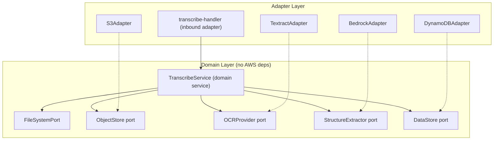
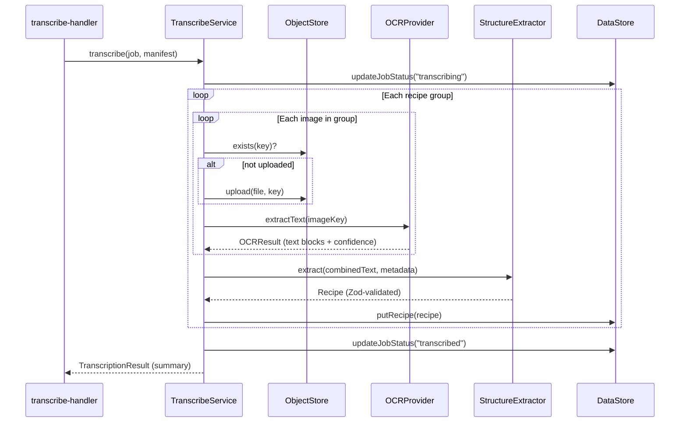

# Design Document: Transcribe Command

## Overview

The transcribe command is step 3 of the Heirloom pipeline. It bridges the gap between raw ingested images and structured, searchable recipe data. Given an active job in `ingested` status with an annotated manifest, the command:

1. Reads the manifest CSV and groups entries by `recipeNumber`
2. Uploads source images to S3 (skipping already-uploaded images)
3. Runs OCR on each image via AWS Textract (async batch, handwriting + print)
4. Combines OCR text per recipe group and extracts structured fields via a Bedrock foundation model (0-shot prompt, Zod-validated response)
5. Persists validated `Recipe` records to DynamoDB
6. Updates job status through `ingested → transcribing → transcribed`

The design follows the project's hexagonal architecture: four new domain port interfaces (`ObjectStore`, `OCRProvider`, `StructureExtractor`, `DataStore`) keep the `TranscribeService` free of AWS SDK dependencies. Concrete adapters (`S3Adapter`, `TextractAdapter`, `BedrockAdapter`, `DynamoDBAdapter`) implement these ports. Processing is per-recipe-group independent, making the pipeline resumable and fault-tolerant — a failure in one group does not block others.

## Architecture



**Data flow per recipe group:**



### Design Decisions

1. **Per-group independence**: Each recipe group is processed independently. If OCR fails for one image, that group is skipped but others continue. This supports resumability (Req 13.3).

2. **Idempotent uploads**: The `ObjectStore.exists()` check before upload avoids redundant S3 PUTs (Req 3.3, 13.2). Re-running transcribe on a `transcribed` job re-processes OCR and extraction but skips uploads.

3. **Job status as a domain port operation**: The `DataStore` port handles job status updates. For the local-first MVP, this can be implemented via the existing `FileSystemPort` (writing a status file). For cloud deployment, the `DynamoDBAdapter` writes to the Jobs table.

4. **Zod validation at the boundary**: The `BedrockAdapter` validates FM responses against `recipeSchema` before returning. Invalid responses are caught at the adapter level and surfaced as errors to the service, which skips the group (Req 5.6).

5. **Extended job status enum**: The existing `jobStatusSchema` (`empty | initialized | ingested`) is extended with `transcribing` and `transcribed` to support the new pipeline states (Req 7).

## Components and Interfaces

### Domain Ports (new)

#### ObjectStore (`src/domain/ports/object-store-port.ts`)

```typescript
export interface ObjectStore {
  upload(localPath: string, key: string): Promise<void>;
  exists(key: string): Promise<boolean>;
}
```

#### OCRProvider (`src/domain/ports/ocr-provider-port.ts`)

```typescript
export interface TextBlock {
  text: string;
  confidence: number; // 0.0–1.0
}

export interface OCRResult {
  blocks: TextBlock[];
}

export interface OCRProvider {
  extractText(imageKey: string): Promise<OCRResult>;
}
```

#### StructureExtractor (`src/domain/ports/structure-extractor-port.ts`)

```typescript
import type { Recipe } from '../models/index.js';

export interface ExtractionInput {
  ocrText: string;
  recipeNumber: string;
  source: string;
  jobName: string;
  imageKeys: string[];
}

export interface StructureExtractor {
  extract(input: ExtractionInput): Promise<Recipe>;
}
```

#### DataStore (`src/domain/ports/data-store-port.ts`)

```typescript
import type { Recipe } from '../models/index.js';
import type { JobStatus } from '../models/index.js';

export interface DataStore {
  putRecipe(recipe: Recipe): Promise<void>;
  getRecipesByJob(jobName: string): Promise<Recipe[]>;
  updateJobStatus(jobName: string, status: JobStatus): Promise<void>;
  getJobStatus(jobName: string): Promise<JobStatus | undefined>;
}
```

### Domain Service

#### TranscribeService (`src/domain/services/transcribe-service.ts`)

```typescript
export interface TranscriptionResult {
  recipesTranscribed: number;
  entriesSkipped: number;
  elapsedMs: number;
  errors: Array<{ recipeNumber: string; error: string }>;
}

export class TranscribeService {
  constructor(
    private readonly fs: FileSystemPort,
    private readonly objectStore: ObjectStore,
    private readonly ocrProvider: OCRProvider,
    private readonly structureExtractor: StructureExtractor,
    private readonly dataStore: DataStore,
  ) {}

  async transcribe(jobName: string, jobDir: string): Promise<TranscriptionResult>;
}
```

The `transcribe` method:
1. Reads and parses the manifest CSV from `jobDir/manifest.csv`
2. Filters entries with non-empty `recipeNumber`, reports skipped count
3. Groups entries by `recipeNumber`
4. Updates job status to `transcribing`
5. For each group: uploads images, runs OCR, extracts structure, persists recipe
6. Updates job status to `transcribed` (or reverts to `ingested` on total failure)
7. Returns a `TranscriptionResult` summary

### Inbound Adapter

#### transcribe-handler (`src/adapters/inbound/transcribe-handler.ts`)

Replaces the current stub. Wires adapters to `TranscribeService`, validates the active job state, prints progress, and reports the summary.

### Outbound Adapters (new)

#### S3Adapter (`src/adapters/outbound/s3-adapter.ts`)

Implements `ObjectStore` using `@aws-sdk/client-s3`. Reads bucket name and region from convict config.

#### TextractAdapter (`src/adapters/outbound/textract-adapter.ts`)

Implements `OCRProvider` using `@aws-sdk/client-textract`. Uses `StartDocumentTextDetection` + `GetDocumentTextDetection` for async batch processing. Normalizes Textract confidence (0–100) to 0.0–1.0.

#### BedrockAdapter (`src/adapters/outbound/bedrock-adapter.ts`)

Implements `StructureExtractor` using `@aws-sdk/client-bedrock-runtime`. Sends a 0-shot prompt with the OCR text, requests structured JSON output, validates the response against `recipeSchema` with Zod.

#### DynamoDBAdapter (`src/adapters/outbound/dynamodb-adapter.ts`)

Implements `DataStore` using `@aws-sdk/lib-dynamodb`. Recipes table uses `jobName` (PK) + `recipeNumber` (SK). Jobs table uses `jobName` (PK) for status tracking.

### CDK Infrastructure

#### StatefulStack additions

- S3 bucket for image storage (`heirloom-images`) with `RETAIN` removal policy
- DynamoDB Recipes table (`heirloom-recipes`): PK `jobName` (S), SK `recipeNumber` (S), `RETAIN`
- DynamoDB Jobs table (`heirloom-jobs`): PK `jobName` (S), `RETAIN`

#### StatelessStack additions

- IAM policies scoped to:
  - S3: `PutObject`, `GetObject`, `HeadObject` on the images bucket
  - DynamoDB: `PutItem`, `GetItem`, `Query` on recipes and jobs tables
  - Textract: `StartDocumentTextDetection`, `GetDocumentTextDetection`
  - Bedrock: `InvokeModel` on the configured model ARN

## Data Models

### Recipe (`src/domain/models/recipe.ts`)

```typescript
import { z } from 'zod/v4';

const confidenceScoreSchema = z.number().min(0).max(1);

export const recipeSchema = z.object({
  jobName: z.string().min(1),
  recipeNumber: z.string().min(1),
  source: z.string(),
  title: z.string().min(1),
  ingredients: z.array(z.string().min(1)),
  instructions: z.array(z.string().min(1)),
  notes: z.string().default(''),
  imageKeys: z.array(z.string().min(1)),
  confidence: z.object({
    title: confidenceScoreSchema,
    ingredients: confidenceScoreSchema,
    instructions: confidenceScoreSchema,
    notes: confidenceScoreSchema,
  }),
});

export type Recipe = z.infer<typeof recipeSchema>;
```

### Extended Job Status

The existing `jobStatusSchema` is extended:

```typescript
export const jobStatusSchema = z.enum([
  'empty',
  'initialized',
  'ingested',
  'transcribing',
  'transcribed',
]);
```

This is a backward-compatible addition — existing jobs with `empty`, `initialized`, or `ingested` status continue to work.

### TranscriptionResult

```typescript
export interface TranscriptionResult {
  recipesTranscribed: number;
  entriesSkipped: number;
  elapsedMs: number;
  errors: Array<{ recipeNumber: string; error: string }>;
}
```

Returned by `TranscribeService.transcribe()` and consumed by the handler for CLI output.

### OCR Types

```typescript
export interface TextBlock {
  text: string;
  confidence: number; // 0.0–1.0
}

export interface OCRResult {
  blocks: TextBlock[];
}
```

### Extraction Input

```typescript
export interface ExtractionInput {
  ocrText: string;
  recipeNumber: string;
  source: string;
  jobName: string;
  imageKeys: string[];
}
```


## Correctness Properties

*A property is a characteristic or behavior that should hold true across all valid executions of a system — essentially, a formal statement about what the system should do. Properties serve as the bridge between human-readable specifications and machine-verifiable correctness guarantees.*

### Property 1: Manifest filtering and grouping

*For any* manifest containing a mix of entries with empty and non-empty `recipeNumber` fields, filtering out entries with empty `recipeNumber` and grouping the remainder by `recipeNumber` SHALL produce groups where: (a) every entry in each group shares the same non-empty `recipeNumber`, (b) no entries with non-empty `recipeNumber` are lost, and (c) the count of filtered-out entries equals the number of entries with empty `recipeNumber` in the original manifest.

**Validates: Requirements 2.2, 2.4**

### Property 2: Upload key pattern

*For any* job name and image filename from a manifest entry, the S3 object key produced by the TranscribeService SHALL equal `<jobName>/<filename>`.

**Validates: Requirements 3.1**

### Property 3: Idempotent upload skip

*For any* image key where the ObjectStore reports the key already exists, the TranscribeService SHALL not call `upload()` for that key. Conversely, for any image key where the ObjectStore reports the key does not exist, the TranscribeService SHALL call `upload()` exactly once.

**Validates: Requirements 3.3, 13.2**

### Property 4: Recipe metadata from manifest

*For any* manifest entry group with a given `jobName`, `recipeNumber`, and `source`, the resulting Recipe record persisted to the DataStore SHALL carry the same `jobName`, `recipeNumber`, and `source` values.

**Validates: Requirements 6.3**

### Property 5: Confidence score boundary validation

*For any* number outside the range [0.0, 1.0], the `recipeSchema` SHALL reject a Recipe object containing that number as a confidence score. *For any* number within [0.0, 1.0], the schema SHALL accept it.

**Validates: Requirements 10.3**

### Property 6: Recipe JSON round-trip

*For any* valid Recipe object, serializing it to JSON via `JSON.stringify` and then parsing the result through `recipeSchema` SHALL produce an object deeply equal to the original.

**Validates: Requirements 10.4**

### Property 7: Fault isolation across recipe groups

*For any* set of recipe groups where a subset of groups encounter errors during OCR or structure extraction, all non-failing groups SHALL still be processed and their Recipe records persisted to the DataStore.

**Validates: Requirements 13.3**

## Error Handling

Errors are handled at two levels: the domain service and the CLI handler.

### TranscribeService (domain layer)

| Scenario | Behavior |
|---|---|
| No active job | Not handled here — the handler checks this before calling the service |
| Manifest read failure | Throws `HeirloomError` — pipeline cannot proceed |
| No annotated entries in manifest | Throws `HeirloomError` with descriptive message |
| Missing image file on disk | Logs warning, skips entry, increments skip count |
| ObjectStore upload failure | Logs warning, skips entry, increments skip count |
| OCRProvider error for an image | Logs warning, skips image, continues with remaining images in group |
| StructureExtractor Zod validation failure | Logs warning, skips recipe group, increments skip count |
| StructureExtractor invocation error | Logs warning, skips recipe group, increments skip count |
| DataStore persistence failure | Logs warning, skips recipe group, increments skip count |
| All entries fail | Reverts job status to `ingested`, returns result with zero successes |
| Partial failures | Sets job status to `transcribed`, returns result with skip count |

### transcribe-handler (adapter layer)

| Scenario | Behavior |
|---|---|
| No active job selected | Prints error: "No active job selected. Run 'heirloom use <job-name>' first", sets `process.exitCode = 1` |
| Job status not `ingested` or `transcribed` | Prints error: "Job must be ingested first. Current status: <status>", sets `process.exitCode = 1` |
| `HeirloomError` from service | Prints `error.message`, sets `process.exitCode = 1` |
| Unexpected error | Re-throws (caught by CLI runner in `cli.ts`) |

All errors use the existing `HeirloomError` class from `src/shared/errors.ts`, consistent with the project's error handling pattern.

## Testing Strategy

### Unit Tests (`*.unit.ts`)

Colocated next to source files, following the existing project pattern.

**TranscribeService** (`transcribe-service.unit.ts`):
- Active job validation (status checks)
- Manifest reading and filtering (empty recipeNumber entries skipped)
- Grouping by recipeNumber
- Upload key construction
- Idempotent upload skip (exists → no upload)
- OCR error handling (skip image, continue)
- Extraction error handling (skip group, continue)
- Zod validation failure handling
- Job status transitions (ingested → transcribing → transcribed)
- Job status revert on total failure
- Summary result accuracy (counts, elapsed time)

**transcribe-handler** (`transcribe-handler.unit.ts`):
- No active job → error message + exit code
- Wrong job status → error message + exit code
- Happy path → calls TranscribeService, prints progress and summary
- Error during processing → prints warning, continues

**Recipe model** (`recipe.unit.ts`):
- Schema accepts valid Recipe objects
- Schema rejects missing required fields
- Schema rejects confidence scores outside [0, 1]
- Schema rejects empty title, empty ingredients/instructions arrays

**Outbound adapters** (`s3-adapter.unit.ts`, `textract-adapter.unit.ts`, `bedrock-adapter.unit.ts`, `dynamodb-adapter.unit.ts`):
- Each adapter unit-tested with mocked AWS SDK clients
- Verify correct SDK method calls, parameter construction, and response mapping
- Verify config values are read from convict

### Property-Based Tests (`*.pbt.ts`)

Using `fast-check` with minimum 100 iterations per property. Each test is tagged with the design property it validates.

**Recipe model** (`recipe.pbt.ts`):
- **Property 5**: Confidence score boundary validation — generate random numbers, verify schema accepts [0, 1] and rejects outside
- **Property 6**: Recipe JSON round-trip — generate valid Recipe objects, serialize/parse, verify equality

**TranscribeService** (`transcribe-service.pbt.ts`):
- **Property 1**: Manifest filtering and grouping — generate random manifests, verify filtering and grouping correctness
- **Property 2**: Upload key pattern — generate random job names and filenames, verify key format
- **Property 3**: Idempotent upload skip — generate random exists/not-exists states, verify upload behavior
- **Property 4**: Recipe metadata from manifest — generate random manifest entries, verify Recipe carries correct metadata
- **Property 7**: Fault isolation — generate random group sets with some failures, verify non-failing groups are processed

### CDK Assertion Tests (`test/`)

- StatefulStack: S3 bucket exists with RETAIN policy, DynamoDB tables exist with correct key schemas and RETAIN policy
- StatelessStack: IAM policies grant scoped access to S3, DynamoDB, Textract, Bedrock

### Integration Tests (future, not in scope for this spec)

- End-to-end pipeline with real AWS services (localstack or sandbox account)
- Textract async job lifecycle
- Bedrock FM invocation with real prompts
